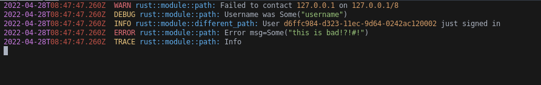

# tree-sitter-tracing-log
Simple tree-sitter grammar for logs. This was designed for a logs generated by the `tracing`
crate used in Rust.

The highlighter has support for the basic structure of a log in addition to some special types such
as IP addresses, strings, and UUIDs, but more could easily be added.

# Example

